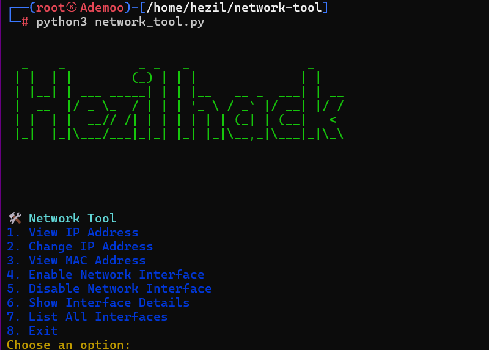

# 🌐 Hezil Network Tool 🛠️

Bienvenue à **Hezil Network Tool** ! Un outil puissant conçu pour gérer et manipuler les interfaces réseau sur Linux. Ce script, écrit en Python, vous permet d'afficher et de modifier les adresses IP et MAC, de gérer l'état des interfaces réseau et de visualiser les détails des interfaces. 🔧

## 🚀 Fonctionnalités

### 🔍 1. Visualiser l'adresse IP
Vous pouvez facilement afficher l'adresse IP actuelle d'une interface réseau. 🖥️ Que ce soit pour l'interface Ethernet (`eth0`) ou une interface Wi-Fi (`wlan0`), ce script récupère cette information pour vous en un clin d'œil.

### 🔄 2. Changer l'adresse IP
Besoin de changer rapidement l'adresse IP de votre interface ? Pas de souci ! 🆕 Utilisez l'option pour définir une nouvelle adresse IP sur l'interface de votre choix. Parfait pour les tests de réseau ou les configurations avancées.

### 🛡️ 3. Visualiser l'adresse MAC
Ce script vous permet également d'afficher l'adresse MAC de n'importe quelle interface réseau. 🔐 L'adresse MAC (Media Access Control) est unique et essentielle pour l'identification des appareils sur le réseau.

### ⚡ 4. Activer une interface réseau
Vous pouvez activer une interface réseau désactivée en une seule commande. 📡

### 📴 5. Désactiver une interface réseau
Vous pouvez également désactiver une interface réseau facilement. Cela peut être pratique lorsque vous avez besoin de déconnecter temporairement une interface.

### 📝 6. Afficher les détails d'une interface
Avec cette option, vous pouvez afficher les détails complets d'une interface réseau spécifique. Vous verrez les informations essentielles telles que l'état, l'adresse IP et plus encore. 🖧

### 🌐 7. Lister les interfaces réseau
Listez toutes les interfaces réseau disponibles sur votre machine. Cela vous permet de voir toutes les interfaces actives et disponibles pour la configuration. 🔍

### ❌ 8. Quitter l'outil
Quittez proprement l'outil avec cette option. 🛑

## 🎯 Utilisation

### Installation

Pour utiliser cet outil, vous devez d'abord cloner le dépôt GitHub :

```bash
git clone https://github.com/ademoo077/network-tool.git
cd network-tool
```
Installez les dépendances requises avec pip :
```bash
pip install termcolor
```
## Exécution
Lancer l'outil avec Python :
Installez les dépendances requises avec pip :
```bash
python3 network_tool.py
```
## 📜 Menu Interactif
Voici à quoi ressemble le menu d'accueil avec toutes les options disponibles :
- 🌐 **Hezil Network Tool** 🛠️
- 1️⃣  Voir l'adresse IP
- 2️⃣  Changer l'adresse IP
- 3️⃣  Voir l'adresse MAC
- 4️⃣  Activer une interface réseau
- 5️⃣  Désactiver une interface réseau
- 6️⃣  Afficher les détails d'une interface réseau
- 7️⃣  Lister toutes les interfaces réseau
- 8️⃣  Quitter

Sélectionnez simplement une option pour interagir avec le réseau.
## 📢 Avertissement
- **🛑 Attention**: Les commandes de ce script nécessitent des droits sudo. Assurez-vous d'avoir les autorisations suffisantes avant de lancer certaines opérations, comme le changement d'adresse IP ou l'activation/désactivation d'une interface
## 🛠️ Technologies Utilisées
- **Python** : Langage principal pour le développement de l'outil.
- **subprocess** : Pour exécuter des commandes système Linux.
- **termcolor** : Pour colorer les sorties dans le terminal.
- **Regex (re)** : Pour extraire les adresses IP des interfaces.
##🧑‍💻 Contribution
Ce projet est ouvert aux contributions ! Si vous avez des idées pour améliorer cet outil ou souhaitez corriger des bugs, n'hésitez pas à faire une pull request. 🙌
🎉 Merci d'utiliser Hezil Network Tool et bonne gestion de vos interfaces réseau ! 🌐💻
## 🖼️ Capture d'écran de Hezil Network Tool

Voici une capture d'écran de l'outil en action :




